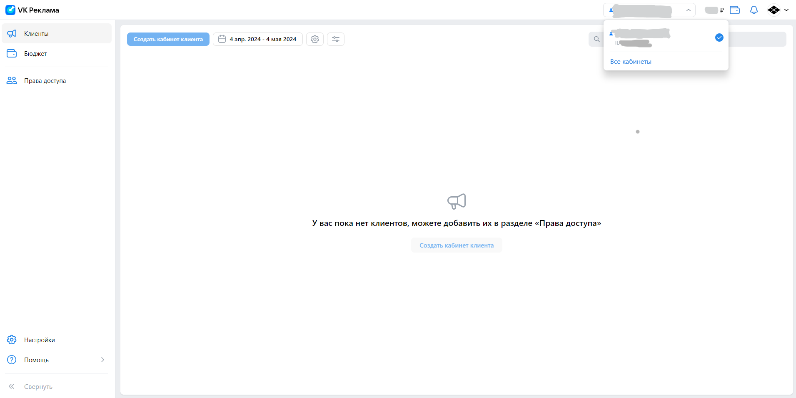
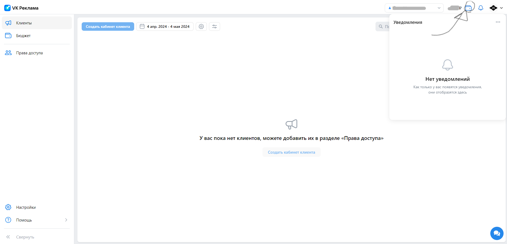
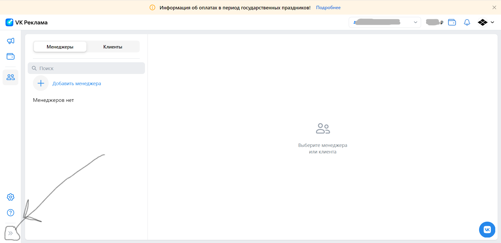
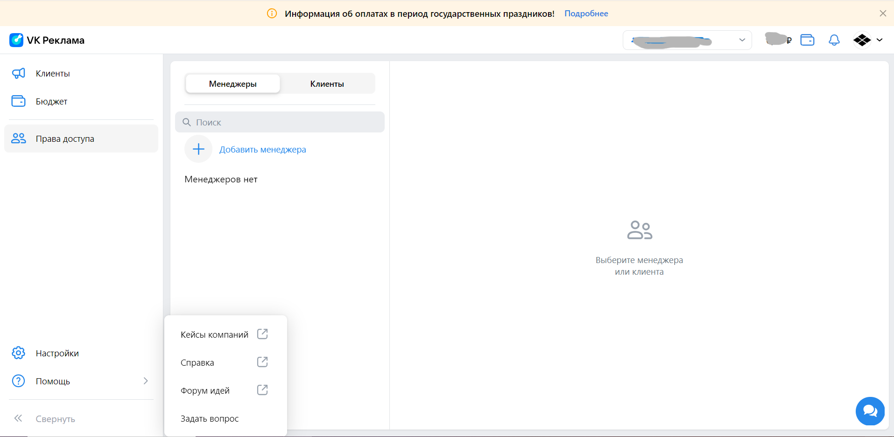
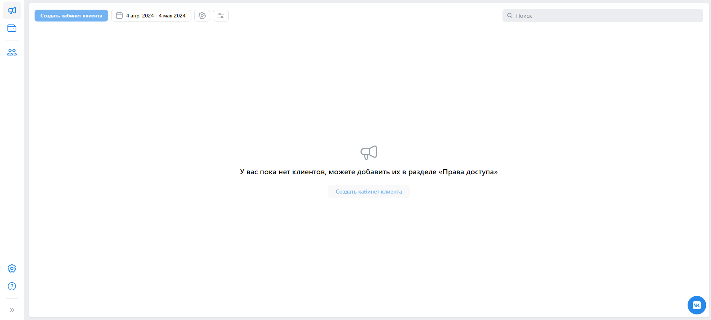
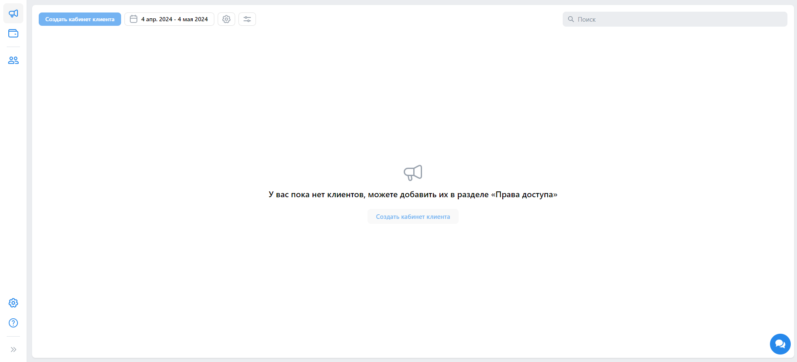
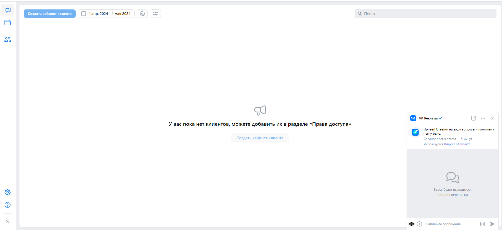

# Чек-листы ads.vk.com

## Личный кабинет - юридическое лицо

1. Тестирование навигационного меню:
    * При входе в учетную запись, происходит переход на URL: https://ads.vk.com/hq/dashboard и открывается следующее меню: 
        
    * При нажатии на блок содержащий имя и фамилия пользователя справа в вернем меню, открывается выпадающее меню доступных кабинетов, как представлено на картинке:
        
    * При нажатии на иконку "Кошелька" справа в вернем меню, открывается выпадающее меню уведомлений, как представлено на картинке:
        
    * При нажатии на иконку "VK Реклама", происходит переход на URL: https://ads.vk.com/hq/dashboard и открывается следующее меню: 
        
    * Проверка дропбокс меню, на иконке "Помощь":
        * Необходимо раскрыть выпадающее, боковое меню, нажатием на иконку с 2-мя серыми стрелками, направленными вправо, которые представленные на фото ниже: 
            
        * Далее нажать на иконку "Помощь". Появляется дропбокс следующего содержания: "Кейсы компаний", "Справка", "Форум идей", "Задать вопрос". 
            
        * В представленном выше дропбоксе, нажать иконку "Кейсы компаний". Должно произойти перенаправление на URL: https://ads.vk.com/cases
        * В представленном выше дропбоксе, нажать иконку "Справка". Должно произойти перенаправление на URL: https://ads.vk.com/help/subcategories/agency
        * В представленном выше дропбоксе, нажать иконку "Форум идей". Должно произойти перенаправление на URL: https://ads.vk.com/upvote
    * Проверка дропбокс меню, на иконке пользователя:
        * При нажатии на иконку пользователя происходит вызов следующего дропбокс меню, которое содержит имя пользователя с подпунктом "Управление VK ID", "Выйти": 
            
        * При нажатии кнопки "Управление VK ID" происходит перенаправление на URL: https://id.vk.com/account/#/main  
            
        * При нажатии кнопки "Выйти" происходит выход из учетной записи и перенаправление на URL:https://ads.vk.com  
            
1. Тестирование вкладки "Клиенты":
    * При нажатии на иконку "Клиенты" в боковом меню, происходит перенаправление на URL: https://ads.vk.com/hq/dashboard и открывается следующее окно:  
        
1. Тестирование вкладки "Бюджет":
    * При нажатии на иконку "Бюджет" в боковом меню, происходит перенаправление на URL: https://ads.vk.com/hq/budget/transactions и открывается следующее окно:  
        
1. Тестирование вкладки "Права доступа":
    * При нажатии на иконку "Права доступа" в боковом меню, происходит перенаправление на URL: https://ads.vk.com/hq/access_rights и открывается следующее окно:  
        
    * При нажатии кнопки "Добавить менеджера", появляется следующее модальное окно:  
        
    * При в воде некорректных данных в поля окна "Добавить менеджера", появляется ошибка "Не удалось добавить этого пользователя. Свяжитесь со службой поддержки."  
        
1. Тестирование окна (ifram-а) технической поддержки:
    * При нажатии на круглую иконку с "Чатом" или символикой ВК, как представлено на рисунке ниже: 
         
         
    Откроется следующее окно:
         
