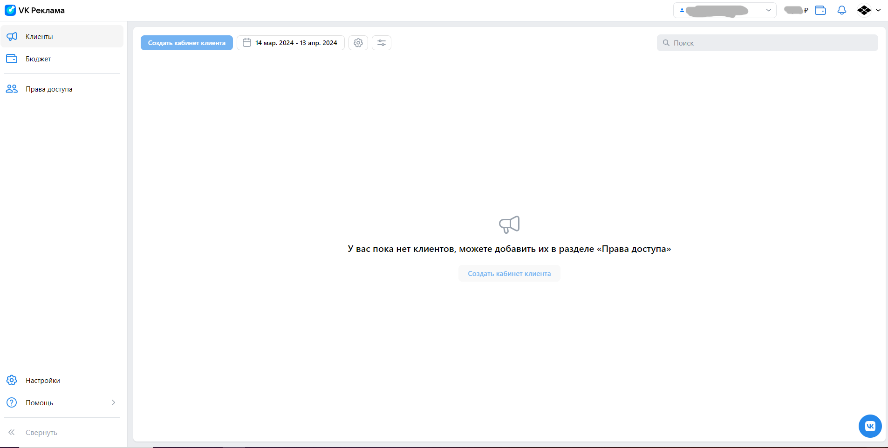
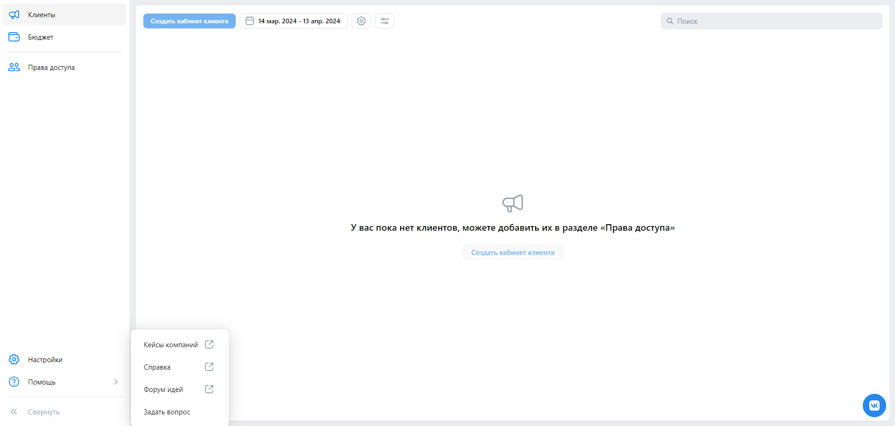
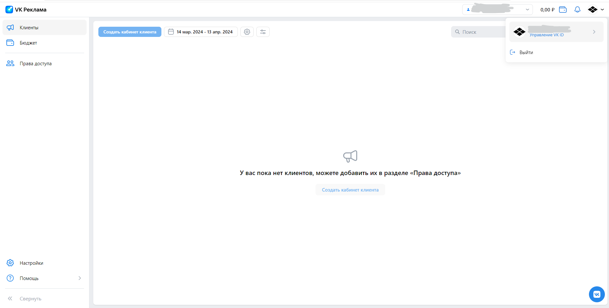
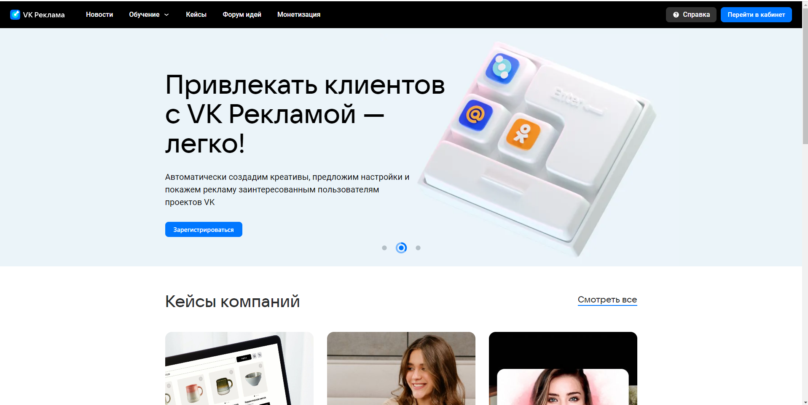
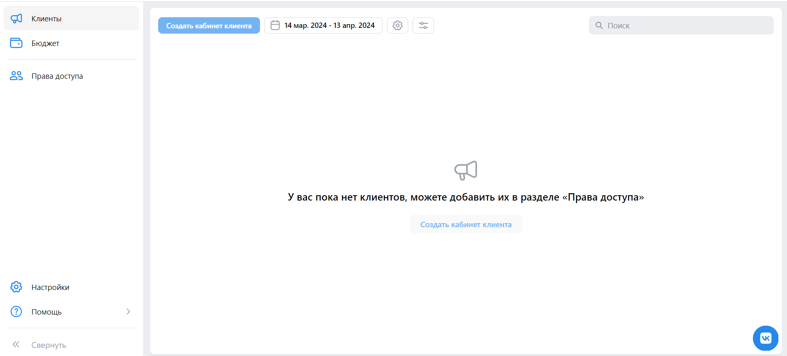
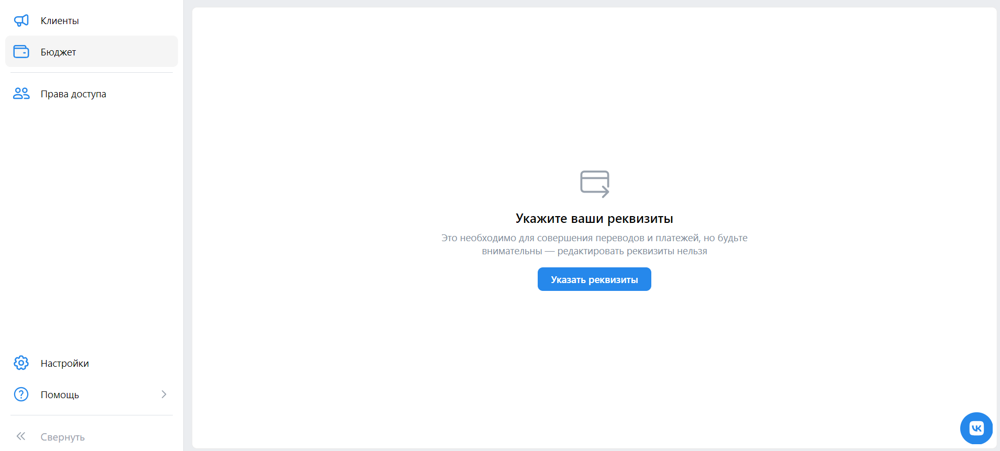
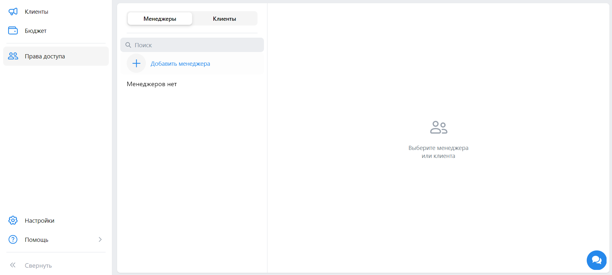
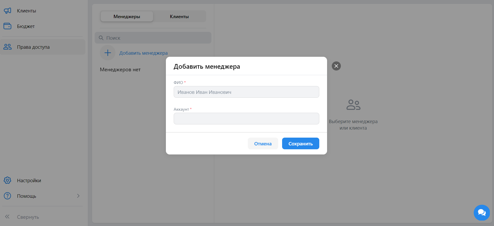
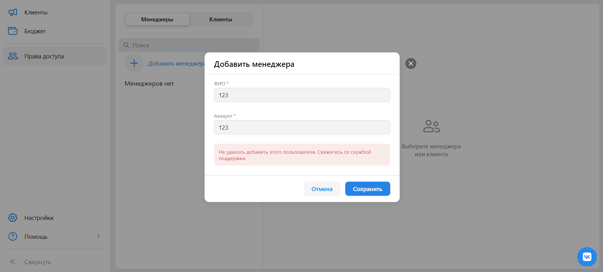

# Чек-листы ads.vk.com

## Личный кабинет - юридическое лицо

1. Тестирование общих компонент:
    * При заходе в аккаунт, происходит переход на URL: https://ads.vk.com/hq/dashboard и открывается следующее меню: 
    
    * При нажатии на значок "VK Реклама", происходит переход на URL: https://ads.vk.com/hq/dashboard и открывается следующее меню: 
    
    * При нажатии кнопки "Помощь", появляется дропбокс следующего содержания: "Кейсы компаний", "Справка", "Форум идей", "Задать вопрос". 
    
    * При последовательном нажатии "Помощь" -> "Кейсы компаний" проsисходит перенаправление на URL: https://ads.vk.com/cases
    * При последовательном нажатии "Помощь" -> "Справка" происходит перенаправление на URL: https://ads.vk.com/help/subcategories/agency
    * При последовательном нажатии "Помощь" -> "Форум идей" происходит перенаправление на URL: https://ads.vk.com/upvote
    * При нажатии на иконку пользователя происходит вызов следующего дропбокс меню, которое содержит имя пользователя с подпунктом "Управление VK ID", "Выйти": 
    
    * При нажатии на иконку пользователя -> "Выйти" происходит выход из учетной записи и перенаправление на URL:https://ads.vk.com  
    
1. Тестирование вкладки "Клиенты":
    * При нажатии на кнопку "Клиенты" в меню слева, происходит перенаправление на URL: https://ads.vk.com/hq/dashboard и открывается следующее окно:  
    
1. Тестирование вкладки "Бюджет":
    * При нажатии на кнопку "Бюджет" в меню слева, происходит перенаправление на URL: https://ads.vk.com/hq/budget/transactions и открывается следующее окно:  
    
1. Тестирование вкладки "Права доступа":
    * При нажатии на кнопку "Права доступа" в меню слева, происходит перенаправление на URL: https://ads.vk.com/hq/access_rights и открывается следующее окно:  
    
    * При нажатии кнопки "Добавить менеджера", появляется следующее модальное окно:  
    
    * При в воде некорректных данных в поля окна "Добавить менеджера", появляется ошибка "Не удалось добавить этого пользователя. Свяжитесь со службой поддержки."  
    
